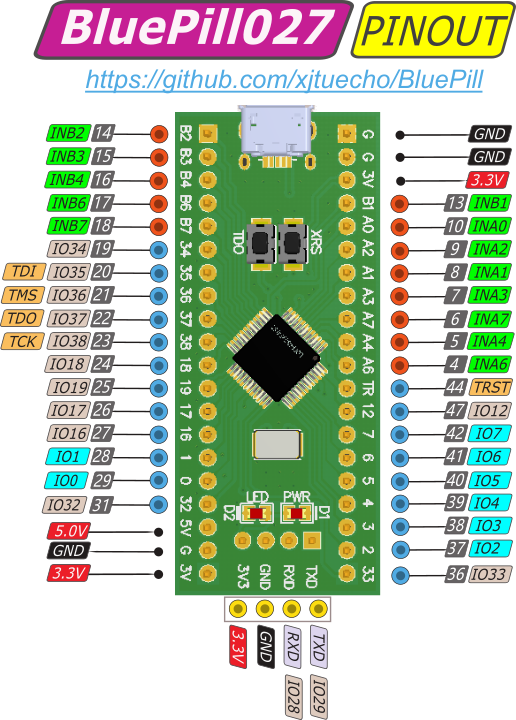

```
C2000 Serial Firmware Upgrader v25.7.22
Copyright (c) 2025 Texas Instruments & ECHO Studio.  All rights reserved.
This application may be used to download images to a Texas Instruments
C2000 microcontroller in the SCI boot mode.

Supported parameters are:

-p COM<num>   - Set the COM port to be used for communications.
-d <device>   - The name of the device to load to:
                f2802x, f2803x, f2805x, f2806x, f2833x, f2837xD, f2837xS, f2807x,
                f28004x, f2838x, f28002x, f28003x, f280013x, f280015x, f28p65x, or f28p55x.
-f <file>     - The file name for download use.
                This file can be intel hex or TI sci8 binary boot format.
-b <num>      - Set the baud rate for the COM port, default 38400.
-c <hex num>  - Specify the CSM password. Must be eight Uint16 for 128 bits.
-s <hex num>  - Specify the sector mask. bit0 for SECTORA, bit1 for SECTORB...
-h or -?      - Show this help.
-q            - Quiet mode. Disable output to stdout.
-w            - Wait for a key press before exiting.
-v            - Enable verbose output

-p and -d are mandatory parameters.
Application files can be intel hex or TI sci8 binary boot format. These can
be generated using the hex2000 utility. An example of how to do this follows:
hex2000 application.out --romwidth 16 --intel  -o application.hex
hex2000 application.out --sci8 --boot --binary -o application.bin
```
