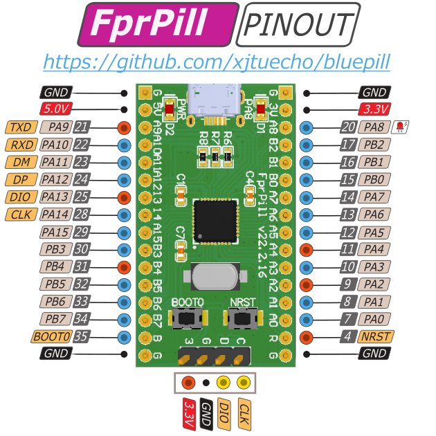

# FprPill核心板简介

GD32FFPRTGU6是兆易创新2017年发布的一颗MCU，从命名来看目标市场是指纹识别市场，批量价格大约只要1个$，这1个$买到了：

- QFN36 6x6封装，0.5mm间距，焊接容易；
- 最高168M的Cortex-M4F内核；
- 128kB SRAM，超大空间；
- 256+256+512kB=1MB FLASH，超大空间。

此外还有USB，性价比超高。GD32FFPRTGU6实际上是GD32F303系列的外设删减版，删减外设省下的硅片面积换成了SRAM和FLASH，封装也换成了小体积的QFN36。不要被型号中的`FPR`迷惑，它实际就是一颗小体积大容量的通用MCU，不一定要用在指纹识别场合，如果你的应用需要小封装但是带大容量的FLASH和SRAM的MCU，那么GD32FFPRTGU6可能就是最佳选择。

FprPill是一款使用GD32FFPRTGU6核心板，用于评估芯片，搭建系统原型等场合。可独立使用，也可以直插面包板洞洞板使用，管脚排列如下：

## 资源汇总

- 演示固件：[FprPill_UDISK_1MB.hex](FprPill_UDISK_1MB.hex) 将该固件写入FprPill以后，FprPill会变成一个1MB容量的U盘
- 数据手册：[GD32FFPRTGU6_Datasheet_v1.0.pdf](GD32FFPRTGU6_Datasheet_v1.0.pdf)
- 用户手册和开发库，由于GD32FFPRTGU6属于GD32F303系列，因此直接用GD32F30x的版本，请自行到[GD32资料网站](https://gd32mcu.com)下载

## 一些介绍GD32FFPRTGU6芯片的文章

- https://zhuanlan.zhihu.com/p/471214112
- https://zhuanlan.zhihu.com/p/348338626
- https://gd32mcu.com/cn/detail/128
- https://www.eefocus.com/article/386774.html