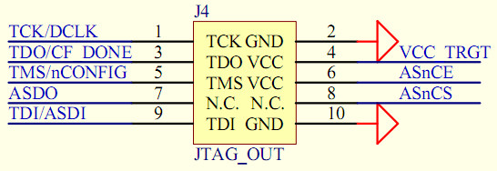

# usb-blaster固件说明

目前市面上的usb-blaster有很多方案，最早的是FT245+CPLD，性能好，成本低；后来有了cy7c68013方案的，成本低性能也低；
再后来就是stm32方案的，MCU涨价之前成本还是很低，性能上去了。还有其它8位机方案，比如CH552等，整体上还是STM32及其
兼容方案性能最好。

由于Altera的CPLD只需要JTAG下载，FPGA使用jic文件下载的话，也只需要JTAG，很多usb-blaster为了省事就去掉了AS下载功能。
然而AG1280Q48这个芯片的FLASH下载刚好需要使用AS下载功能，使用不支持AS下载的usb-blaster就会导致_hybrid.prg文件下载不进去。
解决方案就是使用支持AS下载的usb-blaster，不想再等几天与是就用手头的BluePill开发板做了一个。

下载[固件](./USB-Blaster_STM32F103_HSE8M.hex)，写入BluePill开发板的STM32F103C8T6芯片即可。
usb-blaster固件使用使用PB3-PB9共7个管脚。与JTAG接口对应关系如下：

- TCK-PB9
- TDO-PB8
- TMS-PB7
- ASDO-PB6
- TDI-PB5
- NCS-PB4
- NCE-PB3

Altera/AGM的FPGA使用的标准JTAG接口如下：

如果只使用JTAG接口的话，只用TCK、TDO、TMS、TDI四个信号即可，如果使用AS接口下载，还需要使用ASDO、NCS、NCE三个信号。
对于AG1280Q48，NCE是悬空的，也不需要连接。当然GND和电源也是必不可少的，可以用BluePill的5V电源给目标板供电。